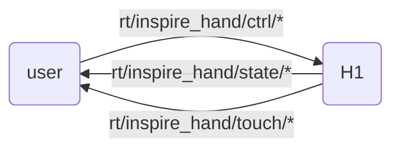

# 灵巧手SDK介绍

H1可搭载 [Inspire Robotics](https://inspire-robots.com/product/frwz/) 的仿人五指灵巧手，该灵巧手具有6个自由度和12个运动关节，并继承了17个触觉传感器，可以模拟人手实现复杂动作。

## 控制方式

因时机械手官方提供485串口的ModBusRTU和ModbusTCP两种通信方式。本SDK使用ModbusTCP与灵巧手进行通信，将数据与控制指令转发为DDS形式。

H1提供一个USB转串口模块，用户可以将该USB插在H1开发计算单元(PC2, PC3)上进行485通讯控制灵巧手，此时端口通常为/dev/ttyUSB0，该模式下，可使用老版本SDK进行通信，但不支持触觉传感器数据获取，该版本SDK不支持485串口通信。

1. 使用因时官方SDK控制

用户可以根据因时灵巧手官方通讯协议自行编写程序控制灵巧手。

2. 使用宇树灵巧手SDK控制

H1通信建立在DDS框架之上。为便于使用unitree_sdk2进行控制灵巧手。宇树提供将ModbusTCP收发的数据转为DDS消息的示例程序(下载链接见文档底部)。

## 宇树SDK接口说明

用户向 `"rt/inspire_hand/ctrl/*"` 话题发送 `"inspire::inspire_hand_ctrl"` 消息控制灵巧手。
从 `"rt/inspire_hand/state/*"` 话题接受 `"inspire::inspire_hand_state"` 消息获取灵巧手状态。
从 `"rt/inspire_hand/touch/*"` 话题接受 `"inspire::inspire_hand_touch"` 消息获取触觉传感器数据。
其中`*`为话题后缀，默认为`r`，表示右手。



## IDL数据格式

采用数组格式的电机数据，内部包含双手12个电机数据。具体MotorCmd_.idl和MotorState_.idl的格式见 [底层服务接口](https://support.unitree.com/home/zh/H1_developer/Basic_Services_Interface)

灵巧手数据格式基本同因时官方说明文档相同，详情查看`inspire_hand_sdk/hand_idl`中`.idl`文件。

```cpp
//inspire_hand_ctrl.idl
module inspire
{
    struct inspire_hand_ctrl
    {
        sequence<int16,6>  pos_set;
        sequence<int16,6>  angle_set;
        sequence<int16,6>  force_set;
        sequence<int16,6>  speed_set;
        int8 mode;
    };
};

//inspire_hand_state.idl
module inspire
{
    struct inspire_hand_state
    {
        sequence<int16,6>  pos_act;
        sequence<int16,6>  angle_act;
        sequence<int16,6>  force_act;
        sequence<int16,6>  current;
        sequence<uint8,6>  err;
        sequence<uint8,6>  status;
        sequence<uint8,6>  temperature;
    };
};


//inspire_hand_touch.idl
module inspire
{
    struct inspire_hand_touch
    {
        sequence<int16,9>   fingerone_tip_touch;      // 小拇指指端触觉数据
        sequence<int16,96>  fingerone_top_touch;      // 小拇指指尖触觉数据
        sequence<int16,80>  fingerone_palm_touch;     // 小拇指指腹触觉数据
        sequence<int16,9>   fingertwo_tip_touch;      // 无名指指端触觉数据
        sequence<int16,96>  fingertwo_top_touch;      // 无名指指尖触觉数据
        sequence<int16,80>  fingertwo_palm_touch;     // 无名指指腹触觉数据
        sequence<int16,9>   fingerthree_tip_touch;    // 中指指端触觉数据
        sequence<int16,96>  fingerthree_top_touch;    // 中指指尖触觉数据
        sequence<int16,80>  fingerthree_palm_touch;   // 中指指腹触觉数据
        sequence<int16,9>   fingerfour_tip_touch;     // 食指指端触觉数据
        sequence<int16,96>  fingerfour_top_touch;     // 食指指尖触觉数据
        sequence<int16,80>  fingerfour_palm_touch;    // 食指指腹触觉数据
        sequence<int16,9>   fingerfive_tip_touch;     // 大拇指指端触觉数据
        sequence<int16,96>  fingerfive_top_touch;     // 大拇指尖触觉数据
        sequence<int16,9>   fingerfive_middle_touch;  // 大拇指指中触觉数据
        sequence<int16,96>  fingerfive_palm_touch;    // 大拇指指腹触觉数据
        sequence<int16,112> palm_touch;                // 掌心触觉数据
    };

};

```

!!! note
    控制消息增加了模式选项，控制指令的组合模式按二进制方式实现，从而实现制定指令
    mode 0：0000（无操作）
    mode 1：0001（角度）
    mode 2：0010（位置）
    mode 3：0011（角度 + 位置）
    mode 4：0100（力控）
    mode 5：0101（角度 + 力控）
    mode 6：0110（位置 + 力控）
    mode 7：0111（角度 + 位置 + 力控）
    mode 8：1000（速度）
    mode 9：1001（角度 + 速度）
    mode 10：1010（位置 + 速度）
    mode 11：1011（角度 + 位置 + 速度）
    mode 12：1100（力控 + 速度）
    mode 13：1101（角度 + 力控 + 速度）
    mode 14：1110（位置 + 力控 + 速度）
    mode 15：1111（角度 + 位置 + 力控 + 速度）  
!!!

+ IDL中的关节顺序

<div style="text-align: center;">
<table border="1">
  <tr>
    <td>Id</td>
    <td>0</td>
    <td>1</td>
    <td>2</td>
    <td>3</td>
    <td>4</td>
    <td>5</td>
  <tr>
    <td rowspan="2">Joint</td>
    <td colspan="6">Hand</td>
  </tr>
  <tr>
    <td>pinky</td>
    <td>ring</td>
    <td>middle</td>
    <td>index</td>
    <td>thumb-bend</td>
    <td>thumb-rotation</td>
  </tr>
</table>
</div>

---

# 
# SDK安装使用
该SDK主要使用python实现，运行依赖于[`unitree_sdk2_python`](https://github.com/unitreerobotics/unitree_sdk2_python),同时利用pyqt5,pyqtgraph进行可视化。

首先 git clone SDK工作目录：

```bash
git clone https://github.com/NaCl-1374/inspire_hand_ws.git
```

建议使用 `venv` 进行虚拟环境管理：

```bash
python -m venv venv
source venv/bin/activate  # Linux/MacOS
# 或
venv\Scripts\activate  # Windows
```

## 安装依赖

1. 安装项目依赖：

    ```bash
    pip install -r requirements.txt
    ```

2. 更新子模块：

    ```bash
    git submodule init  # 初始化子模块
    git submodule update  # 更新子模块到最新版本
    ```

3. 分别安装两个SDK：

    ```bash
    cd unitree_sdk2_python
    pip install -e .

    cd ../inspire_hand_sdk
    pip install -e .
    ```
## 使用

## 灵巧手与环境配置

首先，对设备进行网络配置，灵巧手默认ip为：`192.168.11.210`,设备网段需要与灵巧手处于同一网段。配置完成后执行`ping 192.168.11.210`,检查通信是否正常。

若需要调整灵巧手IP及其他参数，可以执行下面使用示例中 **灵巧手配置面板** ，启动面板进行配置。
面板启动后会自动读取当前网络下设备的信息。修改面板上的参数后，需要点击`写入设置`将参数发送到灵巧手，此时参数并不会生效，若要生效，需要点击`保存设置`并重启设置。

!!!note

    若修改IP，则需要对相关文件中存在的以下代码进行修改，修改其ip选项为修改后的ip。

    ``` python
        # inspire_hand_sdk/example/Vision_driver.py and inspire_hand_sdk/example/Headless_driver.py
        handler=inspire_sdk.ModbusDataHandler(ip=inspire_hand_defaut.defaut_ip,LR='r',device_id=1)

        # inspire_hand_sdk/example/init_set_inspire_hand.py
        window = MainWindow(ip=defaut_ip)
    ```
    其中的`LR`选项，为DDS消息后缀`*`的参数，可以根据设备进行定义。
!!!


### 使用示例

以下为几个常用示例的使用说明：

1. **DDS 发布控制指令**：

    运行以下脚本来发布控制指令：
    ```bash
    python inspire_hand_sdk/example/dds_publish.py
    ```

2. **DDS 订阅灵巧手状态和触觉传感器数据，并可视化**：

    运行以下脚本来订阅灵巧手的状态和传感器数据，并进行数据可视化：
    ```bash
    python inspire_hand_sdk/example/dds_subscribe.py
    ```

3. **灵巧手 DDS 驱动（无图模式）**：

    使用以下脚本进行无图模式的驱动操作：
    ```bash
    python inspire_hand_sdk/example/Headless_driver.py
    ```

4. **灵巧手配置面板**：

    运行以下脚本来使用灵巧手的配置面板：
    ```bash
    python inspire_hand_sdk/example/init_set_inspire_hand.py
    ```

5. **灵巧手 DDS 驱动（面板模式）**：

    通过以下脚本进入面板模式，控制灵巧手的 DDS 驱动：
    ```bash
    python inspire_hand_sdk/example/Vision_driver.py
    ```
6. **DDS 发布控制指令 C++**：

    运行以下命令编译运行示例程序：
    ```bash
    cd inspire_hand_sdk
    mkdir build && cd build
    cmake ..
    make 
    ./hand_dds
    ```  
 !!! note

    若使用多个灵巧手，则可以将类似如下代码，复制对应的类，并重设`ip`，`LR`选项:

    ``` python
        # inspire_hand_sdk/example/Vision_driver.py
        import sys
        from inspire_sdkpy import qt_tabs,inspire_sdk,inspire_hand_defaut
        # import inspire_sdkpy
        if __name__ == "__main__":
            app_r = qt_tabs.QApplication(sys.argv)
            handler_r=inspire_sdk.ModbusDataHandler(ip='********',LR='r',device_id=1)
            window_r = qt_tabs.MainWindow(data_handler=handler,dt=20,name="Hand Vision Driver")
            window_r.reflash()
            window_r.show()
            sys.exit(app_r.exec_())
            # copy for left hand
            app_l = qt_tabs.QApplication(sys.argv)
            handler_l=inspire_sdk.ModbusDataHandler(ip='********',LR='l',device_id=1)
            window_l = qt_tabs.MainWindow(data_handler=handler,dt=20,name="Hand Vision Driver")
            window_l.reflash()
            window_l.show()
            sys.exit(app_l.exec_())
    ```
 !!!

---
